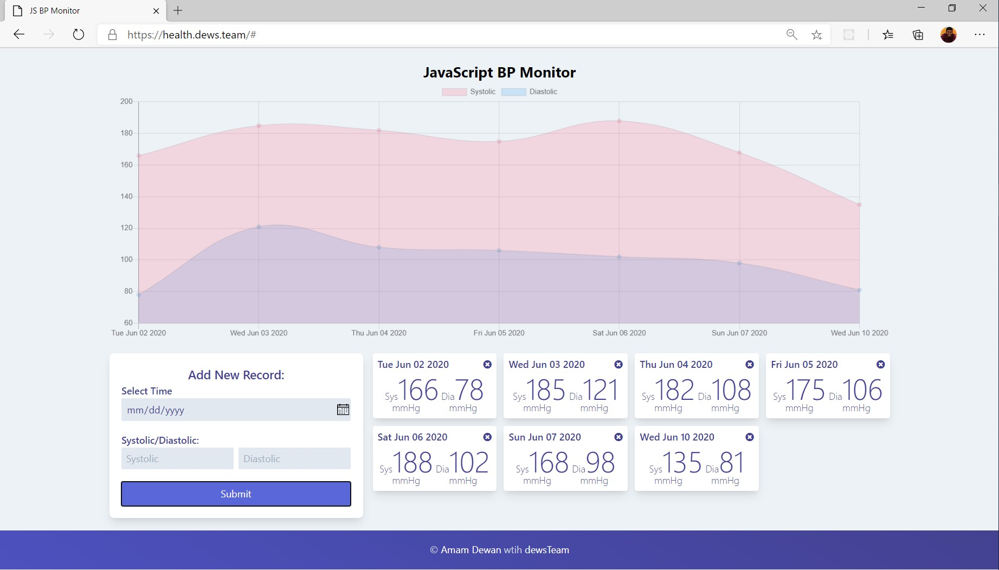

<h2 align="center">Health Monitor</h2>

### About this app
This is a healt moniring app (initially BP monitoring app. More function will added in the future release.) Written in JavaScript
this app will use browser [localStorage](https://developer.mozilla.org/en-US/docs/Web/API/Window/localStorage) so you don't need any account and your data will be safe

### Cradit
- **[Tailwind CSS](https://tailwindcss.com/)**
- **[Chart.js](https://www.chartjs.org/)**
- **[Chance.js](https://chancejs.com/)**
